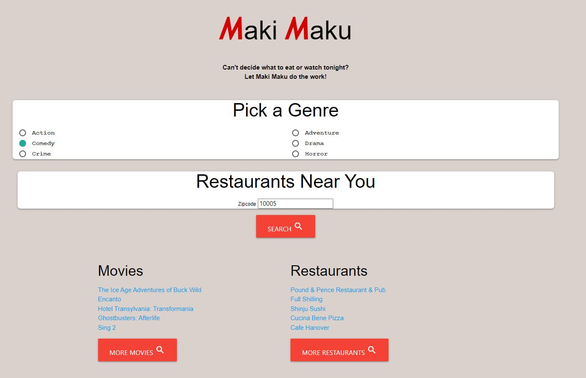

# MakiMaku

Can't decide what to eat or watch tonight. Let Maki Maku decide for you.

Maki Maku allows a user to input a movie genre and zip code. It calls the movie api from "The Movie Database" and the restaurant API from "Documenu"

Tech used:
HTML, Javascript, CSS, Materialize

Link to app: https://camillenicolet.github.io/MakiMaku/

Link to Repo: https://github.com/camilleNicoleT/MakiMaku/tree/main

